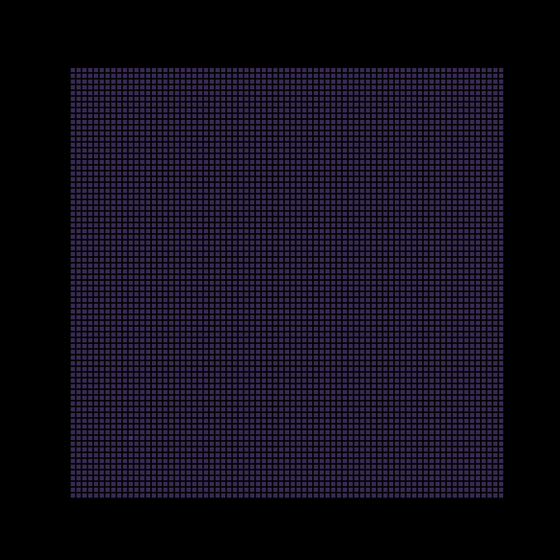
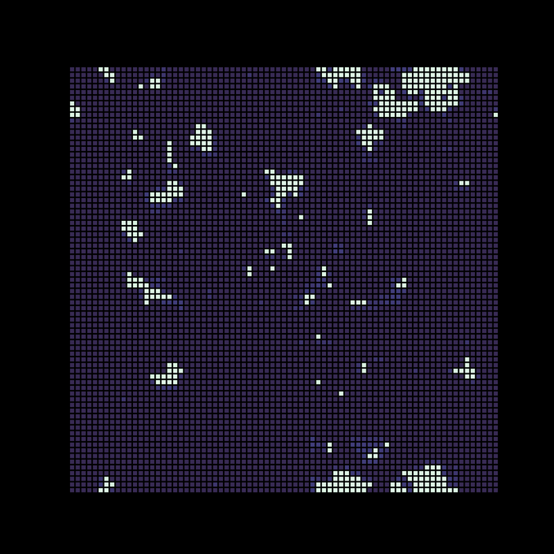
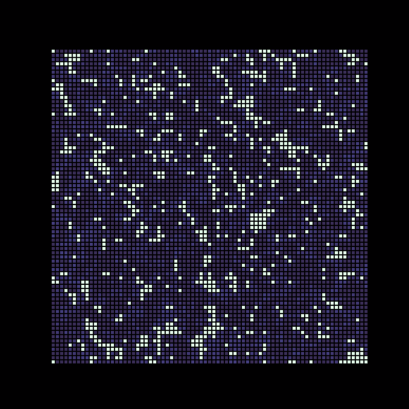
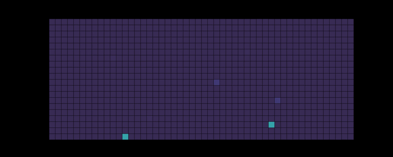
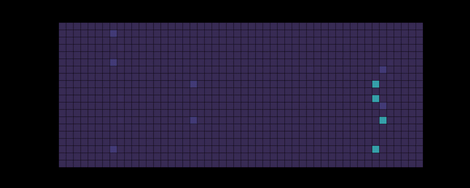
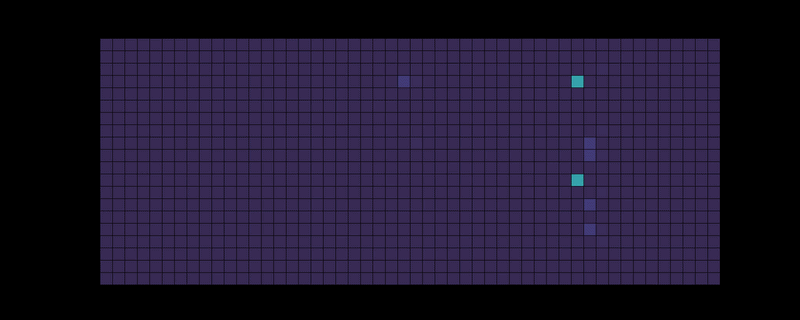
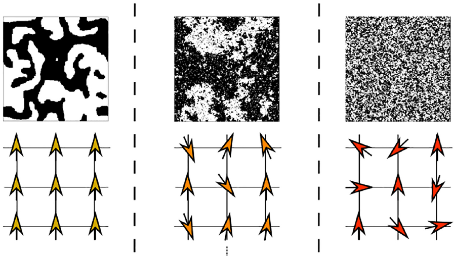

# Brain Criticality: Monte Carlo Simulations of the Critical-Brain Hypothesis

An interactive notebook on *why neural systems may operate near a critical point* — built from
**Metropolis Monte Carlo** (2-D Ising) and a **stochastic branching-network** model of neuronal
avalanches, with animations of the sub-critical, critical, and super-critical regimes.

Course project — NTU Graduate Statistical Mechanics Final Project. An expository, literature review visualisation, not original research

Ising domains below critical temperature

Ising domains at critical temperature

Ising domains above critical temperature

## What this demonstrates

- **Metropolis Monte Carlo for the 2-D Ising model** — energy and magnetisation tracking, temperature
  sweeps / cooling schedules, **Numba-accelerated** inner loop.
- **Stochastic branching-network model of neuronal avalanches** — tuning the branching parameter σ to
  reproduce **sub-critical (σ<1), critical (σ≈1), and super-critical (σ>1)** dynamics.
- **From simulation to critical phenomena** — the Ising <-> avalanche analogy, power-law / scale-free
  avalanche statistics, and scaling-collapse concepts, connected to the experimental neuronal-avalanche
  literature.
- **Scientific visualisation & communication** — animated lattice and network dynamics and a narrated,
  reference-backed walkthrough of the argument (and its limitation).

## Results

Animations of the three regimes make the dynamics legible at a glance:

Subcritical regime

Critical regime

Supercritical regime

| Sub-critical (σ<1) | Critical (σ≈1) | Super-critical (σ>1) |
|---|---|---|
| activity dies out | balanced, long-range | runaway / saturating |

The similarity of the macro behaviour to Ising model is clear and striking
Ising model at different regimes

## Scope & limitation

- This is a **pedagogical reproduction**: it *illustrates and reproduces the qualitative regimes and the
  underlying concepts*. The specific **critical exponents referenced (e.g. τ≈1.7, α≈1.9) are literature
  values (Friedman et al., 2012), not measured here.**
- The notebook's own "caveats" section discusses where the Ising analogy breaks down (equilibrium vs.
  driven dynamics, finite-size effects, choice of control/order parameter).

## References

Friedman et al. (2012), *Universal critical dynamics in high-resolution neuronal avalanche data*, PRL;
Beggs & Plenz (2003); Kinouchi & Copelli (2006); Sethna et al. (2001). Full list in the notebook.
